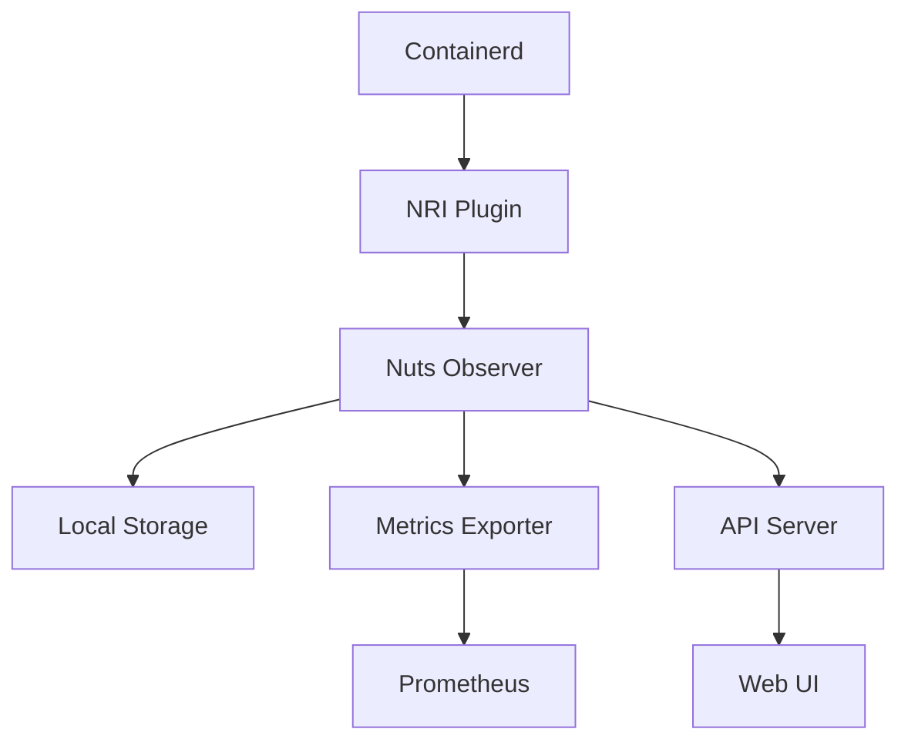
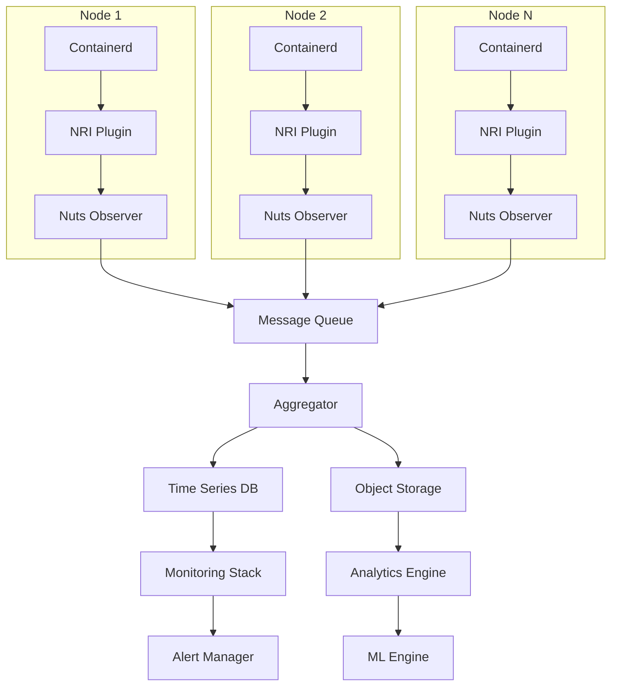

# Nuts Observer 生产部署运维手册

> 版本: v1.0  
> 更新日期: 2026-05-13  
> 适用版本: Nuts Observer v0.2+

---

## 📋 目录

1. [概述](#概述)
2. [系统要求](#系统要求)
3. [部署架构](#部署架构)
4. [安装部署](#安装部署)
5. [配置管理](#配置管理)
6. [安全配置](#安全配置)
7. [监控告警](#监控告警)
8. [故障排查](#故障排查)
9. [性能调优](#性能调优)
10. [备份恢复](#备份恢复)
11. [升级维护](#升级维护)
12. [运维最佳实践](#运维最佳实践)

---

## 📖 概述

Nuts Observer 是一个基于 NRI (Node Resource Interface) 的容器监控和诊断系统，专为生产环境设计，提供实时监控、智能诊断和自动化运维能力。

### 核心功能
- **实时容器监控**: 基于 NRI 接口的高性能容器事件采集
- **智能诊断引擎**: AI 增强的故障诊断和根因分析
- **性能分析**: 详细的资源使用分析和性能瓶颈识别
- **自动化运维**: 基于规则的自动化响应和处理
- **可视化界面**: 直观的监控仪表板和诊断报告

### 设计原则
- **高可用性**: 支持多实例部署和故障自动恢复
- **高性能**: 事件处理延迟 <100ms，吞吐量 >1000 events/sec
- **安全性**: 最小权限原则，端到端加密通信
- **可扩展性**: 支持水平扩展和插件化架构

---

## 🖥️ 系统要求

### 硬件要求

#### 最小配置
- **CPU**: 2 核心
- **内存**: 4GB RAM
- **存储**: 20GB 可用空间
- **网络**: 100Mbps 带宽

#### 推荐配置
- **CPU**: 4+ 核心
- **内存**: 8GB+ RAM
- **存储**: 100GB+ SSD
- **网络**: 1Gbps 带宽

#### 生产环境配置
- **CPU**: 8+ 核心
- **内存**: 16GB+ RAM
- **存储**: 500GB+ 高性能 SSD
- **网络**: 10Gbps 带宽

### 软件要求

#### 操作系统
- **Linux**: Ubuntu 20.04+, CentOS 8+, RHEL 8+
- **内核版本**: 5.4+ (推荐 5.15+)
- **架构**: x86_64, ARM64

#### 容器运行时
- **containerd**: 1.6+ (推荐 1.7+)
- **Docker**: 20.10+ (可选)
- **Kubernetes**: 1.24+ (可选)

#### 依赖组件
- **Rust**: 1.70+ (编译时)
- **OpenSSL**: 1.1.1+
- **Systemd**: 245+

---

## 🏗️ 部署架构

### 单节点部署



### 集群部署



---

## 🚀 安装部署

### 1. 预安装检查

```bash
# 检查系统要求
./scripts/check-system-requirements.sh

# 检查 containerd 版本
containerd --version

# 检查 NRI 支持
ls /run/nri/
```

### 2. 二进制安装

```bash
# 下载最新版本
wget https://github.com/your-org/nuts-observer/releases/latest/download/nuts-observer-linux-amd64.tar.gz

# 解压
tar -xzf nuts-observer-linux-amd64.tar.gz
cd nuts-observer-linux-amd64

# 安装到系统目录
sudo cp nuts-observer /usr/local/bin/
sudo cp nuts-adapters /usr/local/bin/
sudo chmod +x /usr/local/bin/nuts-observer*
```

### 3. 源码编译安装

```bash
# 克隆仓库
git clone https://github.com/your-org/nuts-observer.git
cd nuts-observer

# 安装 Rust 工具链
curl --proto '=https' --tlsv1.2 -sSf https://sh.rustup.rs | sh
source ~/.cargo/env

# 编译 release 版本
cargo build --release

# 安装
sudo cp target/release/nuts-observer /usr/local/bin/
sudo cp target/release/nuts-adapters /usr/local/bin/
```

### 4. 配置文件部署

```bash
# 创建配置目录
sudo mkdir -p /etc/nuts-observer
sudo mkdir -p /var/lib/nuts-observer
sudo mkdir -p /var/log/nuts-observer

# 复制配置文件
sudo cp config.yaml /etc/nuts-observer/
sudo cp systemd/nuts-observer.service /etc/systemd/system/

# 设置权限
sudo chown -R nuts:nuts /var/lib/nuts-observer
sudo chown -R nuts:nuts /var/log/nuts-observer
```

### 5. NRI 插件配置

```bash
# 安装 NRI 插件
sudo mkdir -p /opt/nri/plugins
sudo cp target/release/libnri_observer.so /opt/nri/plugins/

# 配置 NRI
sudo mkdir -p /etc/nri
sudo cp deploy/nri/nuts-observer-nri.conf /etc/nri/
sudo cp deploy/nri/nuts-observer-nri.toml /etc/nri/

# 重启 containerd 以加载 NRI 插件
sudo systemctl restart containerd
```

### 6. 服务启动

```bash
# 重新加载 systemd
sudo systemctl daemon-reload

# 启用服务
sudo systemctl enable nuts-observer

# 启动服务
sudo systemctl start nuts-observer

# 检查状态
sudo systemctl status nuts-observer
```

---

## ⚙️ 配置管理

### 主配置文件 (config.yaml)

```yaml
# Nuts Observer 主配置
version: "v0.2"

# 服务器配置
server:
  host: "0.0.0.0"
  port: 8080
  tls:
    enabled: true
    cert_file: "/etc/ssl/certs/nuts-server.crt"
    key_file: "/etc/ssl/private/nuts-server.key"
  cors:
    allowed_origins: ["https://dashboard.example.com"]
    allowed_methods: ["GET", "POST", "PUT", "DELETE"]

# NRI 配置
nri:
  enabled: true
  socket_path: "/run/nri/nuts-observer.sock"
  plugin_path: "/opt/nri/plugins/libnri_observer.so"
  timeout_ms: 5000
  retry_count: 3
  batch_size: 100
  flush_interval_ms: 1000

# 数据存储配置
storage:
  type: "sqlite"  # sqlite, postgresql, mysql
  connection_string: "file:/var/lib/nuts-observer/data.db"
  max_connections: 10
  connection_timeout_ms: 5000
  query_timeout_ms: 30000

# 日志配置
logging:
  level: "info"  # debug, info, warn, error
  format: "json"  # text, json
  file: "/var/log/nuts-observer/nuts.log"
  max_size_mb: 100
  max_files: 10
  compress: true

# 指标配置
metrics:
  enabled: true
  endpoint: "/metrics"
  export_interval_ms: 15000
  retention_days: 30

# 诊断配置
diagnosis:
  enabled: true
  ai:
    enabled: true
    endpoint: "http://ai-service:8080/v1/analyze"
    timeout_ms: 30000
    max_retries: 3
  rules:
    directory: "/etc/nuts-observer/rules"
    reload_interval_ms: 60000

# 告警配置
alerts:
  enabled: true
  channels:
    - type: "webhook"
      url: "https://hooks.slack.com/services/..."
      timeout_ms: 5000
    - type: "email"
      smtp_server: "smtp.example.com:587"
      username: "alerts@example.com"
      password: "${SMTP_PASSWORD}"
      recipients: ["admin@example.com"]
```

### 环境变量配置

```bash
# /etc/nuts-observer/environment
export NUTS_LOG_LEVEL=info
export NUTS_SERVER_PORT=8080
export NUTS_NRI_SOCKET_PATH=/run/nri/nuts-observer.sock
export NUTS_DB_CONNECTION_STRING=file:/var/lib/nuts-observer/data.db
export NUTS_AI_ENDPOINT=http://ai-service:8080/v1/analyze
export NUTS_SMTP_PASSWORD=your-smtp-password
```

---

## 🔒 安全配置

### 1. 用户权限配置

```bash
# 创建专用用户
sudo useradd -r -s /bin/false nuts
sudo usermod -L nuts

# 设置文件权限
sudo chmod 750 /etc/nuts-observer
sudo chmod 640 /etc/nuts-observer/config.yaml
sudo chown -R nuts:nuts /etc/nuts-observer
```

### 2. TLS 证书配置

```bash
# 生成自签名证书（测试环境）
sudo openssl req -x509 -nodes -days 365 -newkey rsa:2048 \
  -keyout /etc/ssl/private/nuts-server.key \
  -out /etc/ssl/certs/nuts-server.crt \
  -subj "/C=CN/ST=Beijing/L=Beijing/O=Company/CN=nuts-observer"

# 设置证书权限
sudo chmod 600 /etc/ssl/private/nuts-server.key
sudo chmod 644 /etc/ssl/certs/nuts-server.crt
sudo chown nuts:nuts /etc/ssl/private/nuts-server.key
```

### 3. 防火墙配置

```bash
# UFW 配置
sudo ufw allow 22/tcp
sudo ufw allow 8080/tcp
sudo ufw enable

# iptables 配置
sudo iptables -A INPUT -p tcp --dport 8080 -j ACCEPT
sudo iptables -A INPUT -p tcp --dport 22 -j ACCEPT
sudo iptables -A INPUT -j DROP
```

### 4. SELinux 配置

```bash
# 设置 SELinux 上下文
sudo semanage fcontext -a -t bin_t "/usr/local/bin/nuts-observer"
sudo restorecon -v /usr/local/bin/nuts-observer

# 允许网络连接
sudo setsebool -P httpd_can_network_connect 1
```

---

## 📊 监控告警

### 1. Prometheus 集成

```yaml
# prometheus.yml
global:
  scrape_interval: 15s

scrape_configs:
  - job_name: 'nuts-observer'
    static_configs:
      - targets: ['localhost:8080']
    metrics_path: '/metrics'
    scrape_interval: 10s
```

### 2. Grafana 仪表板

```json
{
  "dashboard": {
    "title": "Nuts Observer Monitoring",
    "panels": [
      {
        "title": "Event Processing Rate",
        "type": "graph",
        "targets": [
          {
            "expr": "rate(nuts_events_processed_total[5m])",
            "legendFormat": "Events/sec"
          }
        ]
      },
      {
        "title": "Memory Usage",
        "type": "graph",
        "targets": [
          {
            "expr": "process_resident_memory_bytes",
            "legendFormat": "Memory"
          }
        ]
      }
    ]
  }
}
```

### 3. 告警规则

```yaml
# alerts.yml
groups:
  - name: nuts-observer
    rules:
      - alert: HighEventLatency
        expr: histogram_quantile(0.95, rate(nuts_event_duration_seconds_bucket[5m])) > 0.1
        for: 2m
        labels:
          severity: warning
        annotations:
          summary: "High event processing latency"
          description: "95th percentile latency is {{ $value }}s"

      - alert: ServiceDown
        expr: up{job="nuts-observer"} == 0
        for: 1m
        labels:
          severity: critical
        annotations:
          summary: "Nuts Observer service is down"
          description: "Nuts Observer has been down for more than 1 minute"
```

---

## 🔧 故障排查

### 常见问题及解决方案

#### 1. 服务启动失败

```bash
# 检查服务状态
sudo systemctl status nuts-observer

# 查看详细日志
sudo journalctl -u nuts-observer -f

# 检查配置文件
sudo nuts-observer --config /etc/nuts-observer/config.yaml --check
```

#### 2. NRI 连接问题

```bash
# 检查 NRI socket
ls -la /run/nri/
sudo lsof /run/nri/nuts-observer.sock

# 检查 containerd NRI 插件
sudo containerd-ctr plugins ls | grep nri

# 重启 NRI 服务
sudo systemctl restart containerd
```

#### 3. 性能问题

```bash
# 检查系统资源
top -p $(pgrep nuts-observer)
iostat -x 1
sar -u 1 10

# 检查事件处理延迟
curl -s http://localhost:8080/metrics | grep nuts_event_duration

# 检查内存使用
curl -s http://localhost:8080/metrics | grep process_resident_memory
```

#### 4. 数据库问题

```bash
# 检查数据库连接
sudo -u nuts sqlite3 /var/lib/nuts-observer/data.db ".tables"

# 检查数据库大小
du -h /var/lib/nuts-observer/data.db

# 数据库维护
sudo -u nuts sqlite3 /var/lib/nuts-observer/data.db "VACUUM;"
```

### 日志分析

#### 关键日志模式

```bash
# 查看错误日志
sudo grep -i error /var/log/nuts-observer/nuts.log

# 查看性能相关日志
sudo grep -i latency /var/log/nuts-observer/nuts.log

# 查看连接问题
sudo grep -i connection /var/log/nuts-observer/nuts.log
```

---

## ⚡ 性能调优

### 1. 系统级优化

```bash
# 内核参数优化
echo 'net.core.somaxconn = 65535' >> /etc/sysctl.conf
echo 'net.ipv4.tcp_max_syn_backlog = 65535' >> /etc/sysctl.conf
echo 'vm.swappiness = 10' >> /etc/sysctl.conf
sysctl -p

# 文件描述符限制
echo '* soft nofile 65535' >> /etc/security/limits.conf
echo '* hard nofile 65535' >> /etc/security/limits.conf
```

### 2. 应用级优化

```yaml
# 性能优化配置
nri:
  batch_size: 200          # 增大批量大小
  flush_interval_ms: 500  # 减少刷新间隔
  worker_threads: 8        # 增加工作线程

storage:
  max_connections: 20     # 增加数据库连接
  connection_timeout_ms: 2000
  query_timeout_ms: 10000

metrics:
  export_interval_ms: 5000 # 减少指标导出间隔
```

### 3. 内存优化

```yaml
# 内存管理配置
memory:
  max_heap_size_mb: 2048
  gc_interval_ms: 30000
  buffer_pool_size: 1000
```

---

## 💾 备份恢复

### 1. 数据备份

```bash
#!/bin/bash
# backup.sh

BACKUP_DIR="/backup/nuts-observer"
DATE=$(date +%Y%m%d_%H%M%S)

# 创建备份目录
mkdir -p $BACKUP_DIR/$DATE

# 备份配置文件
cp -r /etc/nuts-observer $BACKUP_DIR/$DATE/

# 备份数据库
sqlite3 /var/lib/nuts-observer/data.db ".backup $BACKUP_DIR/$DATE/data.db"

# 备份日志
cp -r /var/log/nuts-observer $BACKUP_DIR/$DATE/

# 压缩备份
tar -czf $BACKUP_DIR/nuts-observer-$DATE.tar.gz -C $BACKUP_DIR $DATE
rm -rf $BACKUP_DIR/$DATE

# 清理旧备份（保留30天）
find $BACKUP_DIR -name "*.tar.gz" -mtime +30 -delete
```

### 2. 数据恢复

```bash
#!/bin/bash
# restore.sh

BACKUP_FILE=$1
RESTORE_DIR="/tmp/nuts-observer-restore"

# 解压备份
tar -xzf $BACKUP_FILE -C /tmp

# 停止服务
sudo systemctl stop nuts-observer

# 恢复配置文件
sudo cp -r $RESTORE_DIR/etc/nuts-observer/* /etc/nuts-observer/

# 恢复数据库
sudo cp $RESTORE_DIR/var/lib/nuts-observer/data.db /var/lib/nuts-observer/
sudo chown nuts:nuts /var/lib/nuts-observer/data.db

# 启动服务
sudo systemctl start nuts-observer
```

---

## 🔄 升级维护

### 1. 版本升级流程

```bash
#!/bin/bash
# upgrade.sh

NEW_VERSION=$1
CURRENT_VERSION=$(nuts-observer --version)

echo "Upgrading from $CURRENT_VERSION to $NEW_VERSION"

# 1. 备份当前版本
./backup.sh

# 2. 下载新版本
wget https://github.com/your-org/nuts-observer/releases/download/$NEW_VERSION/nuts-observer-linux-amd64.tar.gz

# 3. 停止服务
sudo systemctl stop nuts-observer

# 4. 替换二进制文件
tar -xzf nuts-observer-linux-amd64.tar.gz
sudo cp nuts-observer-linux-amd64/nuts-observer /usr/local/bin/
sudo cp nuts-observer-linux-amd64/nuts-adapters /usr/local/bin/

# 5. 更新配置文件（如果需要）
# nuts-observer --migrate-config /etc/nuts-observer/config.yaml

# 6. 启动服务
sudo systemctl start nuts-observer

# 7. 验证升级
nuts-observer --version
sudo systemctl status nuts-observer
```

### 2. 滚动升级（集群环境）

```bash
#!/bin/bash
# rolling-upgrade.sh

NODES=("node1" "node2" "node3")
NEW_VERSION=$1

for node in "${NODES[@]}"; do
    echo "Upgrading $node..."
    
    # 1. 驱逐 Pod（可选）
    kubectl drain $node --ignore-daemonsets --delete-emptydir-data
    
    # 2. 升级节点
    ssh $node "./upgrade.sh $NEW_VERSION"
    
    # 3. 恢复节点
    kubectl uncordon $node
    
    # 4. 等待节点就绪
    kubectl wait --for=condition=Ready node/$node --timeout=300s
    
    echo "Node $node upgraded successfully"
done
```

---

## 📋 运维最佳实践

### 1. 日常检查清单

```bash
#!/bin/bash
# daily-check.sh

echo "=== Nuts Observer Daily Health Check ==="

# 检查服务状态
systemctl is-active nuts-observer && echo "✅ Service running" || echo "❌ Service down"

# 检查端口监听
netstat -tlnp | grep :8080 && echo "✅ Port listening" || echo "❌ Port not listening"

# 检查磁盘空间
df -h /var/lib/nuts-observer | tail -1 | awk '{print $5}' | sed 's/%//' | awk '{if($1<80) print "✅ Disk usage OK"; else print "❌ Disk usage high"}'

# 检查内存使用
free | grep Mem | awk '{if($3/$2*100<80) print "✅ Memory usage OK"; else print "❌ Memory usage high"}'

# 检查错误日志
ERROR_COUNT=$(grep -c "ERROR" /var/log/nuts-observer/nuts.log 2>/dev/null || echo 0)
if [ $ERROR_COUNT -eq 0 ]; then
    echo "✅ No errors in logs"
else
    echo "❌ $ERROR_COUNT errors found in logs"
fi

# 检查事件处理
EVENT_RATE=$(curl -s http://localhost:8080/metrics | grep "nuts_events_processed_total" | tail -1 | awk '{print $2}')
if [ -n "$EVENT_RATE" ] && [ $EVENT_RATE -gt 0 ]; then
    echo "✅ Event processing normal"
else
    echo "❌ Event processing issues"
fi

echo "=== Health Check Complete ==="
```

### 2. 监控指标

#### 关键性能指标 (KPI)
- **事件处理延迟**: <100ms (P95)
- **事件处理吞吐量**: >1000 events/sec
- **服务可用性**: >99.9%
- **内存使用率**: <80%
- **CPU 使用率**: <70%
- **磁盘使用率**: <85%

#### 告警阈值
```yaml
alerts:
  high_latency:
    threshold: 100ms
    duration: 2m
    severity: warning
  
  low_throughput:
    threshold: 500 events/sec
    duration: 5m
    severity: warning
  
  service_down:
    threshold: 0%
    duration: 1m
    severity: critical
  
  high_memory:
    threshold: 85%
    duration: 5m
    severity: warning
```

### 3. 容量规划

#### 资源需求计算
```bash
# 每个容器事件大小估算
EVENT_SIZE_BYTES=1024  # 1KB per event

# 每日事件量估算
EVENTS_PER_DAY_PER_CONTAINER=1000
CONTAINER_COUNT=100
DAILY_EVENTS=$((EVENTS_PER_DAY_PER_CONTAINER * CONTAINER_COUNT))

# 存储需求（30天保留）
STORAGE_DAYS=30
TOTAL_STORAGE_GB=$((DAILY_EVENTS * EVENT_SIZE_BYTES * STORAGE_DAYS / 1024 / 1024 / 1024))

echo "Estimated storage requirement: ${TOTAL_STORAGE_GB}GB"
```

### 4. 安全运维

#### 定期安全检查
```bash
#!/bin/bash
# security-check.sh

echo "=== Security Audit ==="

# 检查文件权限
find /etc/nuts-observer -type f -perm /o+r -exec echo "❌ World readable file: {}" \;

# 检查 SUID 文件
find /usr/local/bin/nuts-observer* -perm -4000 -exec echo "❌ SUID file: {}" \;

# 检查开放端口
netstat -tlnp | grep nuts-observer

# 检查进程权限
ps aux | grep nuts-observer | awk '{print $1}' | sort | uniq

echo "=== Security Audit Complete ==="
```

---

## 📞 支持与联系

### 技术支持
- **文档**: https://docs.nuts-observer.io
- **GitHub**: https://github.com/your-org/nuts-observer
- **Issues**: https://github.com/your-org/nuts-observer/issues
- **社区**: https://community.nuts-observer.io

### 紧急联系
- **邮件**: support@nuts-observer.io
- **Slack**: #nuts-observer-support
- **电话**: +86-xxx-xxxx-xxxx

### 版本发布
- **稳定版**: 每季度发布
- **补丁版**: 按需发布
- **预览版**: 每月发布

---

*本手册将随产品更新持续维护，请关注最新版本。*
